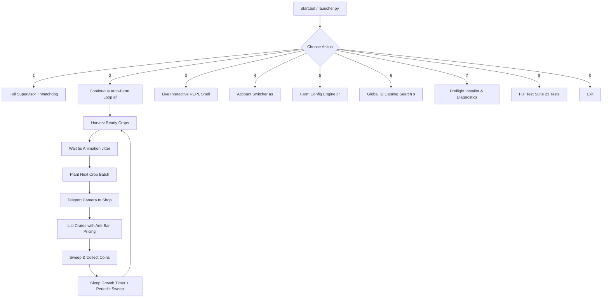

# Application Flow & State Machine — Hay Star

## Master User Flow

## State Machine: Continuous Auto-Farm Loop (`auto_farm_loop.py`)
1. **STATE_INIT:** Load configurations, connect TCP client or engage dry-run simulation mode.
2. **STATE_HARVEST:** Dispatch `nharvest`, log increment to `stats.total_harvests`.
3. **STATE_ANIM_WAIT:** Wait 5.0s ± 0.5s for scythe swing and silo collection animations.
4. **STATE_PLANT:** Dispatch `nplant <crop_id>`, verify seeds sown.
5. **STATE_JUMP_SHOP:** Execute `execute_jump('shop')` via ADB swipe and TCP signal.
6. **STATE_SELL:** Scan empty crates, list items using safe humanized prices (`antibank`), set newspaper advertisement on crate 0.
7. **STATE_COLLECT:** Send `rss_claim_all` to sweep accumulated coins from sold crates.
8. **STATE_GROWTH_WAIT:** Calculate crop maturity duration (e.g. 120s for wheat). Loop with interruptible sleep while running 15s periodic coin sweeps.
9. **STATE_LOOP:** Repeat cycle until `stop` signal (`x` or `Ctrl+C`).
