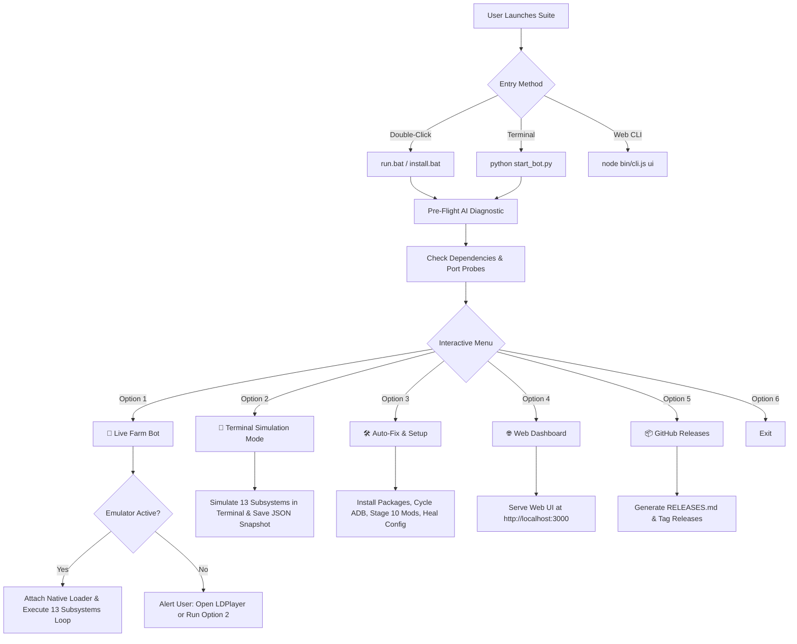

# App Flow & User Journey — Hay Day Bot Suite

## User Journey Stages
1. **Entry**: Single click on `run.bat` starts the engine immediately.
2. **Detection**: Port probes identify if LDPlayer 9 / BlueStacks is open on loopback.
3. **Execution**: If emulator is active, wheat loop runs autonomously every 120s; if not, user can immediately test with option 2.
4. **Monitoring**: User views real-time harvest counters and coin logs in the terminal or web dashboard.
5. **Self-Healing**: If a game crash or ADB drop occurs, the watchdog cycles the connection and re-attaches automatically.
